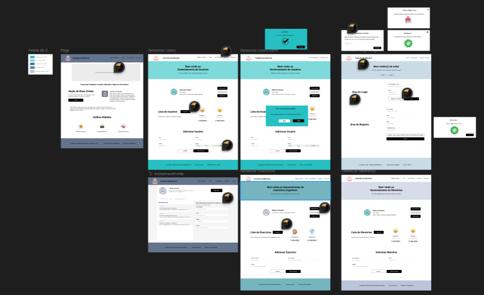

# Sistema Web de Auxílio para Pessoas com Alzheimer
Nosso sistema web foi criado com o objetivo de oferecer suporte prático e acessível para pessoas que enfrentam desafios relacionados à memória, auxiliando não apenas os usuários, mas também familiares e cuidadores nessa jornada. Com foco em ajudar pessoas no enfrentamento e nas dificuldades causadas pelo Alzheimer.

## Funcionalidades
### Gerenciamento de Memórias e Recordações 📸

- Armazenamento e Organização de Memórias 

- Guarde fotos, vídeos (**TALVEZ**) que capturam momentos especiais.
- Organize memórias para facilitar o acesso.

### Gerenciamento de Usuários 🙍‍♀️

- Múltiplos perfis que permite que familiares e cuidadores colaborem no acompanhamento das atividades e informações do usuário.
- Ferramentas para monitorar o progresso, registrar interações e garantir que as necessidades individuais sejam atendidas.
### Exercícios Cognitivos Personalizados 🧠

- Criação de atividades interativas desenvolvidas pelos próprios usuários, para estimular funções cognitivas, como jogos de memória, quebra-cabeças e desafios matemáticos.

### Acessibilidade e Simplicidade

- Interface intuitiva, adaptada às necessidades de pessoas com dificuldades cognitivas, incluindo fontes maiores, botões claros e navegação simplificada.

## Tecnologias Utilizadas
O desenvolvimento deste sistema utilizou um conjunto de tecnologias essenciais, cuidadosamente selecionadas para garantir uma solução eficiente, funcional e acessível. Cada ferramenta desempenhou um papel específico no processo, desde o planejamento visual até a implementação e testes.

| Tecnologia   | Descrição       | Uso no Projeto                           |
| :---------- | :--------- | :---------------------------------- |
| HTML | Linguagem de marcação padrão para a criação de páginas web. | Estrutura básica das páginas |
| CSS | Linguagem de estilo para a apresentação de documentos HTML. |Estilização e layout da interface. |
| PHP |Linguagem de script de servidor usada principalmente para desenvolvimento web. | Utilizada para o back-end, gerenciando a lógica do servidor e a interação com o banco de dados. |
| Figma |Ferramenta de design colaborativo para a criação de interfaces. |Utilizada para o design e prototipagem das interfaces. |
| XAMPP |Plataforma de servidor que inclui Apache, MySQL, PHP e Perl. |Utlizado o servidor web local para o desenvolvimento. |

## APIs Utilizadas

| API               | Função no Projeto                                                |
| ----------------- | ---------------------------------------------------------------- |
| Firebase       |Integrado ao sistema como uma solução moderna e confiável para gerenciar autenticação de usuários e o envio de e-mails de redefinição de senha. |
| SupaBase       | Banco de dados no funcionamento do sistema, garantindo que todas as informações sejam armazenadas, gerenciadas e recuperadas de forma eficiente e segura.|

## Equipe de Desenvolvimento
Venho agradecer pela Equipe o empenho e dedicação que tiveram durante o processo de criação do sistema. Um projeto que tem sua continuação no modelo Mobile, no repositório do  Sr.**[WESLEY](https://github.com/WesleyS08)**

 - **[DAVI DE BRITO JUNIOR:](https://github.com/DaveBrito)** Desenvolvedor Full-Stack \ **UX Designer** (User Experience Designer)
 - **[ERIC PENERES CARNEIRO:](https://github.com/EricW900)** Desenvolvedor Back-end
 - **[WESLEY SILVA DOS SANTOS:](https://github.com/WesleyS08)** Desenvolvedor Back-end

## Figma do Projeto

Explore nosso projeto no Figma para visualizar o design da plataforma e junte-se a nós nesta jornada de inovação e avanço socioeconômico!

Explore o design do projeto no Figma [aqui](https://www.figma.com/design/NSjR5dHsVhxcw5vzUtDiKi/Untitled?node-id=0-1&t=P8uSR0S9ilOzqO1M-1).

